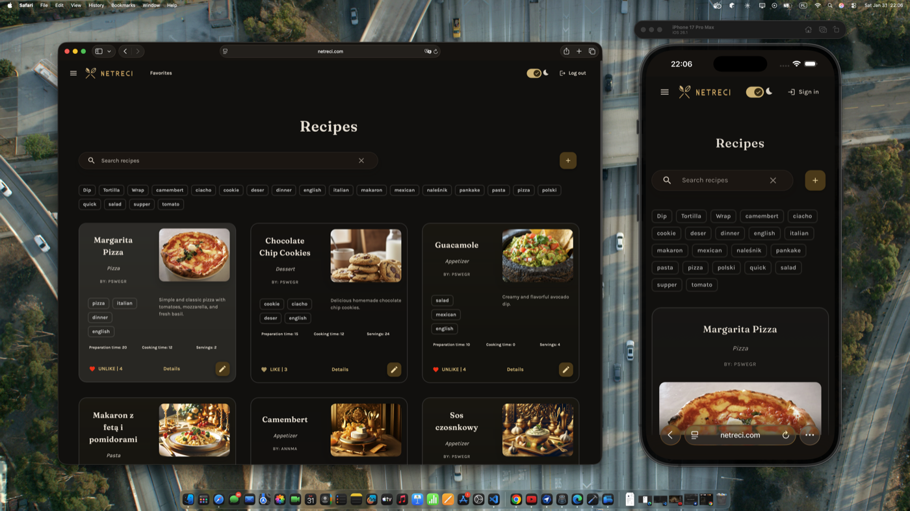
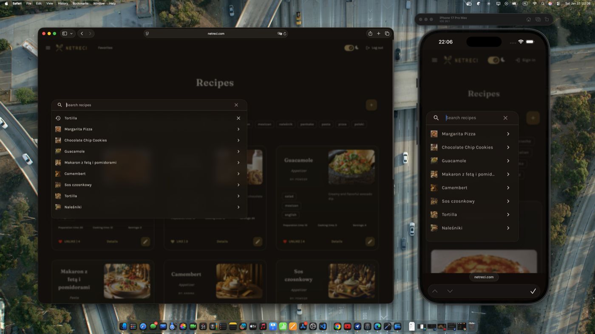
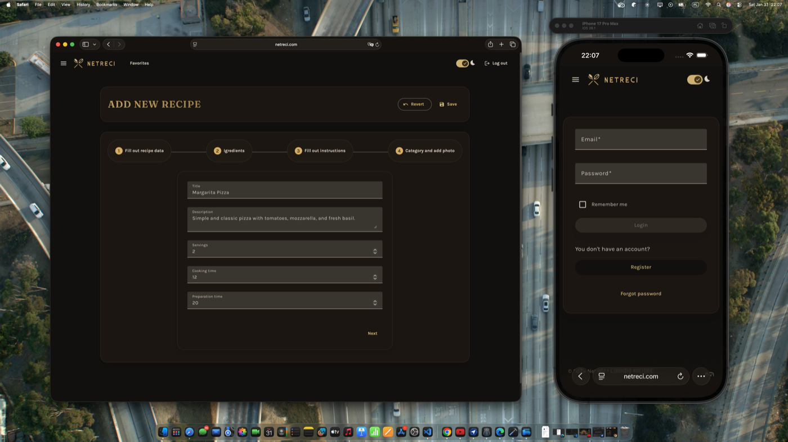
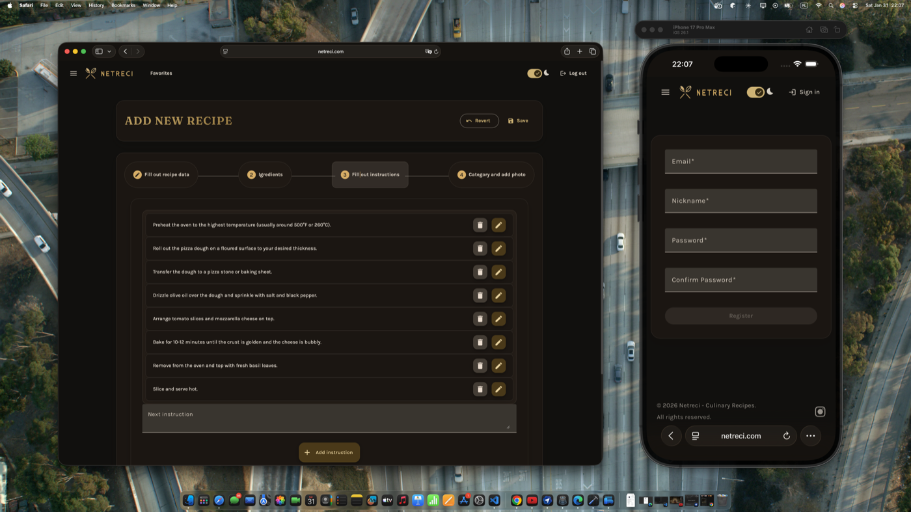
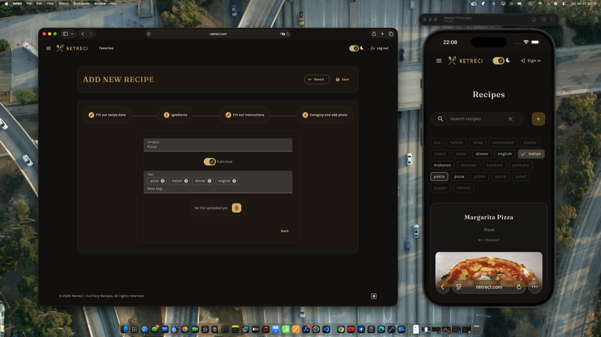

# Netreci - Culinary Recipes App

Modern Angular app for discovering, creating, and managing recipes. Built with a warm, polished UI, responsive layouts, and Material Design components tailored for a cozy cooking experience.



## Features
- Browse and search recipes with fast filtering and tags
- Create, edit, and manage your own recipes
- Favorite recipes and keep a personal collection
- Responsive layout for desktop, tablet, and mobile
- Light and dark modes with custom theming

## Tech Stack
- Angular 20
- Angular Material + CDK
- RxJS
- TypeScript

## Getting Started
```bash
npm install
npm run start
```

App runs at `http://localhost:4200`.

## Scripts
- `npm run start` - start dev server
- `npm run build` - production build
- `npm run test` - unit tests

## Screenshots







